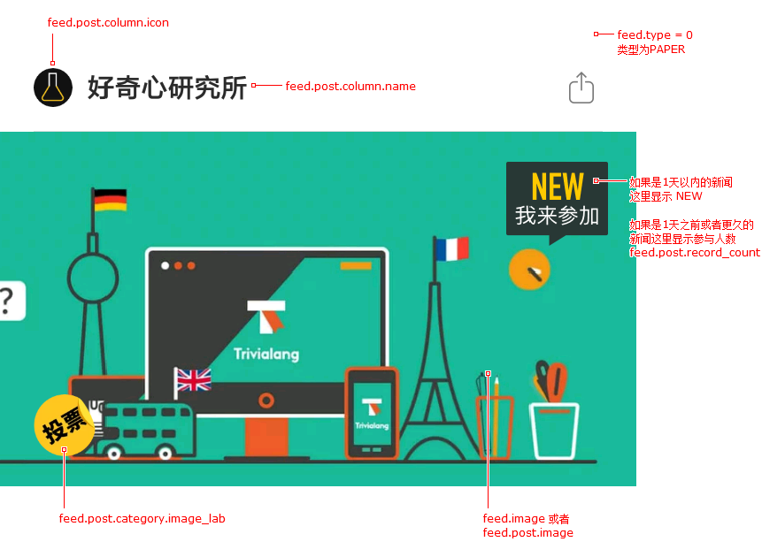
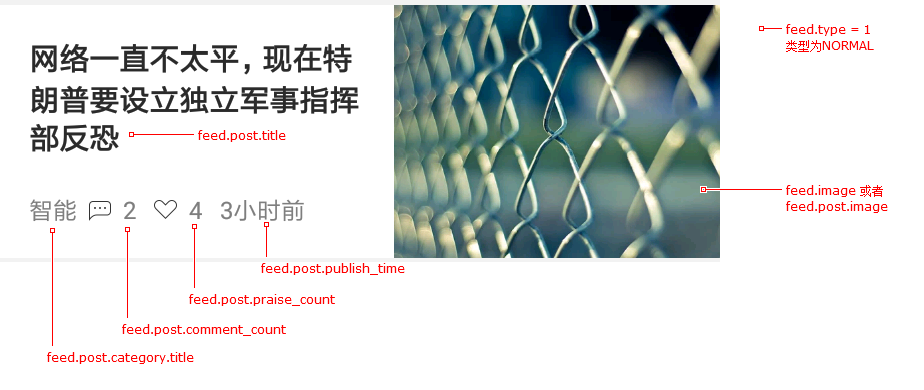
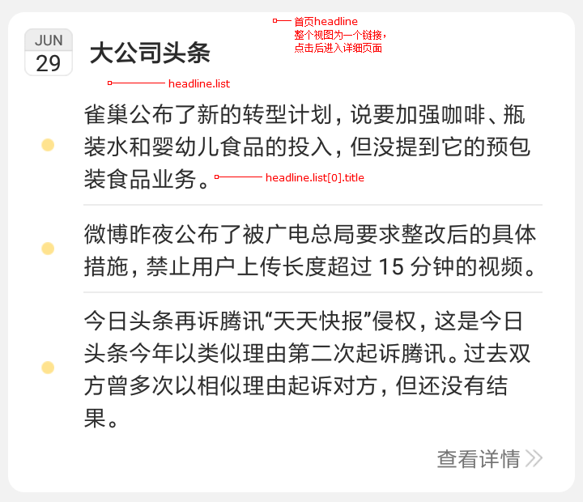

> Note: 所有API返回结果格式如下

```typescript
{
    "meta": {
        status: ${status_code},    // 200
        msg: ${message}            // "success"
    },
    "response": {
        // 请求结果对象
    }
}

```

# 首页

## 获取NEWS

### 地址

http://app3.qdaily.com/homes/index/${key}.json

### 参数

| 名称     | 类型    | 描述         |
|----------|:------:|:------------:|
| key      | string | 分页索引，第一页为`0`。 <br/>下一页的索引为返回结果中的 last_key 字段 |

### 结果

#### Response

```typescript
interface News {
    has_more: boolean;
    last_key: string;       // 下一页的索引
    feeds: Feed[];          // 新闻列表
    banners: Banner[];      // 首页banner轮播列表
    headline: HeadLine;     // 首页新闻头条
    banners_ad: Banner[];   // 首页banner轮播广告
    feeds_ad: Feed[];       // 广告新闻列表
}
```

#### Feed 新闻数据

```typescript
interface Feed {
    image: string;      // 缩略图
    type: FeedType;     // 类型
    post: Post;         // 详细信息
}

enum FeedType {
    PAPER = 0,      // LABS中的新闻类型，通常用户可以参与讨论
    NORMAL = 1,     // 一般类型，大多数为这种类型
    LARGE = 2       // 这种类型在界面上显示出来比较大
}
```

#### Post 新闻详细信息

```typescript
interface Post {
    id: number;                 // 新闻id
    title: string;              // 新闻标题
    description: string;        // 新闻简短描述
    publish_time: number;       // 发布时间，距离1970年1月1日的秒数，即 Date.now() / 1000
    image: string;              // 新闻图片
    comment_count: number;      // 评论数量
    praise_count: number;       // 点赞数量
    appview: string;            // 新闻网址
    category: PostCategory;     // 新闻类别
    record_count?: number;      // 类型为Paper的新闻，参与的人数
    column?: PostColumn;        // 新闻所在的column
}

interface PostCategory {
    id: number;                 // 类别id
    title: string;              // 类别名称
    normal: string;
    normal_hl: string;
    image_lab?: string;         // Paper的左下角图标
    image_experiment: string;
}

interface PostColumn {
    id: number;
    name: string;
    description: string;
    icon: string;
    image: string;
    share: Share;
}
```






##### Banner 首页轮播

```typescript
interface Banner extends Feed {
}
```


##### HeadLine 头条

```typescript
interface HeadLine extends Feed {
    list: {                     // 头条列表，通常是3个
        title: string;
        description: string;
        keywords: string[];
    }[];
}
```



### 示例数据

[实例](example_data/homes0.json)


## 获取LABS

### 地址

http://app3.qdaily.com/papers/index/${key}.json

### 参数

| 名称     | 类型    | 描述         |
|----------|:------:|:------------:|
| key      | string | 分页索引，第一页为`0`。 <br/>下一页的索引为返回结果中的 last_key 字段 |

### 结果

#### Response

```typescript
interface Papers {
    has_more: boolean;
    last_key: string;
    feeds: Feed[];
    paper_topics: PaperTopic[];         // LABS中的话题列表
}

interface PaperTopic {
    id: string;
    insert_location: number;
    insert_content: PaperTopicContent;
}

interface PaperTopicContent {
    id: string;
    icon: string;
    title: string;
    description: string;
    image: string;
}
```

### 示例数据

[实例](example_data/papers0.json)


# 文章

## 获取文章内容

### 地址

http://app3.qdaily.com/articles/detail/${id}.json

### 参数

| 名称     | 类型    | 描述         |
|----------|:------:|:------------:|
| id      | number | 文章id |

### 结果

#### Response

```typescript
interface Article {
    id: number;         // 文章id
    body: string;       // 文章对应的html内容
    js: string[];       // 文章需要加载的js列表(暂时用不到)
    css: string[];      // 文章需要加载的css列表(暂时用不到)
    image: string[];    // 文章中的图片列表，由于点击查看图片的轮播
}
```

### 示例数据

[实例](example_data/article_detail.json)


## 获取文章信息

### 地址

http://app3.qdaily.com/articles/info/${id}.json

### 参数

| 名称     | 类型    | 描述         |
|----------|:------:|:------------:|
| id      | number | 文章id |

### 结果

#### Response

```typescript
interface ArticleInfo extends Feed {
    share: Share;       // 分享信息
    author: Author;     // 文章作者信息
}

interface Share {
    url: string;        // 分享的url
    title: string;      // 分享的标题
    text: string;       // 分享的文本
    image: string;      // 分享的图片
}

interface Author {
    id: number;
    description: string;
    avatar: string;
    name: string;
    background_image: string;
}
```

### 示例数据

[实例](example_data/article_info.json)


# 分类

## 获取分类列表


### 地址

http://app3.qdaily.com/homes/left_sidebar.json

### 结果

#### Response

```typescript
response: TopicCategory[];

interface TopicCategory {
    id: number;             // 分类的id
    title: string;          // 分类的标题
    normal: string;
    white_icon: string;     // 分类对应的图标(白色主题)
    black_icon: string;     // 分类对应的图标(黑色主题)
}
```

### 示例数据

[实例](example_data/left_sidebar.json)


## 获取分类新闻数据


### 地址

http://app3.qdaily.com/categories/index/${categoryId}/${key}.json

### 参数

| 名称     | 类型    | 描述         |
|----------|:------:|:------------:|
| categoryId      | number | 类别id |
| key      | string | 分页索引，第一页为`0`。 <br/>下一页的索引为返回结果中的 last_key 字段 |

### 结果

#### Response

```typescript
// 参见NEWS
interface Categories {
    has_more: boolean;
    last_key: string;
    feeds: Feed[];
    feeds_ad: Feed[];
}
```

### 示例数据

[实例](example_data/category1.json)